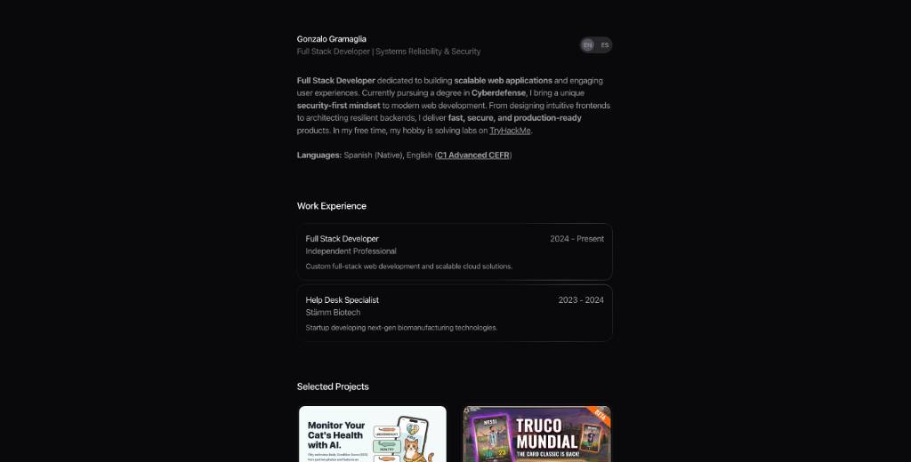
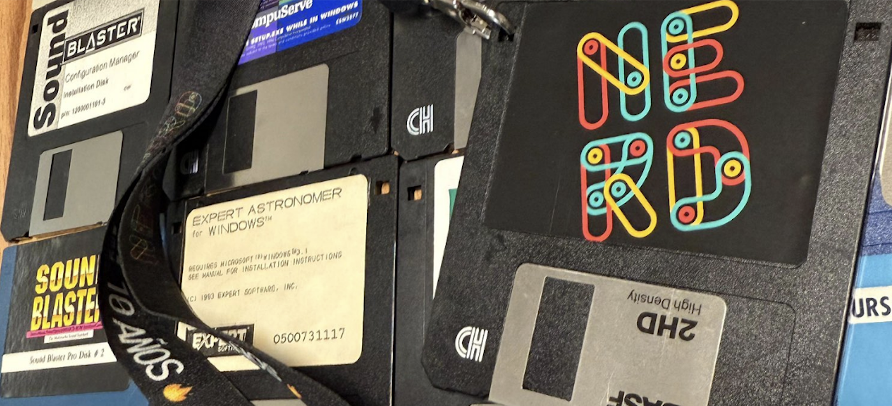

# 💻 Gonzalo Gramaglia's Personal Portfolio

> **Full Stack Developer | Systems Reliability & Security**

A modern, bilingual (English/Spanish) personal portfolio built with Next.js (App Router), React, Tailwind CSS, and Framer Motion. It serves as a centralized hub showcasing my trajectory as a Full Stack Developer and my academic background in Cyberdefense. 

🔗 **Live Demo:** [**gonzagramaglia.github.io**](https://gonzagramaglia.github.io)

[](https://gonzagramaglia.github.io)

---

## ✨ Key Features

- **AI-Powered Workflow** — Built alongside Antigravity & Kiro for autonomous development, and integrated with **CodeRabbit** (`.coderabbit.yaml`) for assertive, high-level, automated code reviews on every pull request.
- **Bilingual Support (i18n)** — Seamless switching between English and Spanish using a custom context and path-based routing (`/es/*`).
- **Interactive UI Components** — Engaging micro-interactions including Magnetic Links, Morphing Dialogs for project details, and Spotlight effects, powered by `motion/react`.
- **MDX Content** — Rich text rendering for blog posts and work history, allowing for embedded React components.
- **Centralized Data Management** — All structured data (projects, education, social links) is managed in a single `app/data.ts` file for easy updates.
- **Static Site Generation (SSG)** — Pre-rendered pages for maximum performance and SEO benefits, hosted on GitHub Pages / Vercel.

---

## 🧉 Prerequisites

- **Node.js** ≥ 23
- **Yarn** (package manager)

---

## 🛠️ Local Setup

### 1. Clone & Install

```bash
git clone https://github.com/gonzagramaglia/gonzagramaglia.github.io.git
cd gonzagramaglia.github.io
yarn install
```

### 2. Run the Development Server

```bash
yarn dev
```

Open in browser at `http://localhost:3000`.

### 3. Build for Production

```bash
yarn build
```

---

## 🏗️ Project Structure

```
gonzagramaglia.github.io/
├── app/                  # Next.js App Router (English pages)
│   ├── es/               # Spanish localized pages
│   ├── blog/             # MDX blog posts
│   └── work/             # MDX work experience posts
├── components/           # Reusable UI components
│   └── ui/               # Highly interactive, isolated UI elements (motion)
├── docs/                 # Project documentation and reports
├── journey/              # PR standards and developer workflow docs
├── lib/                  # Shared utilities and constants
├── public/               # Static assets cleanly organized
│   ├── projects/         # Project thumbnails
│   ├── work/             # Work experience images
│   ├── blog/             # Blog post assets
│   └── ui/               # General UI assets
└── .agents/              # Agent skills and project rules
```



---

## 📖 Documentation

| Document | Description |
|----------|-------------|
| [**`docs/project-report.md`**](docs/project-report.md) | Comprehensive overview of the project architecture and features |
| [**`journey/pr-standards.md`**](journey/pr-standards.md) | Standardized PR template and workflow rules |
| [**`AGENTS.md`**](AGENTS.md) | Rules and instructions for AI agents working on this project |
| [**`.agents/skills/`**](.agents/skills/) | Custom AI Agent skills (/architect, /imprint, /review, etc.) |

---

## 🛠️ Tech Stack

- **Framework:** Next.js (App Router)
- **Language:** TypeScript
- **Styling:** Tailwind CSS
- **Animations:** Motion (Framer Motion)
- **Icons:** Lucide React
- **Deployment:** Vercel / GitHub Pages

---

## 📄 License

MIT